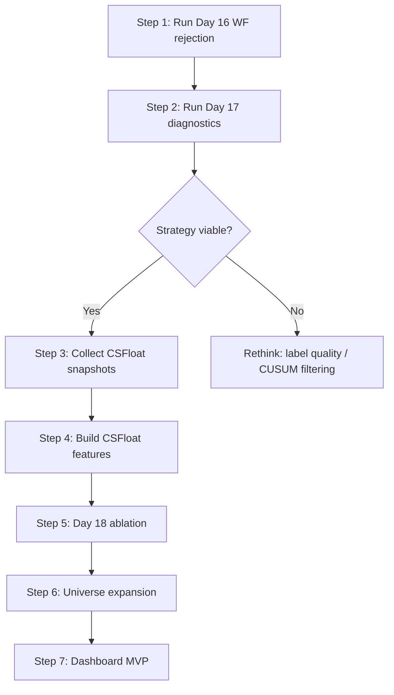

# Implementation Plan — Days 16.5 → 20

## Current State

| Component | Status | Key Output |
|-----------|--------|------------|
| Data (48 FT skins, SteamDT) | ✅ | `data/raw/kline/`, `data/processed/price_bars_day3.parquet` |
| Features (177 cols) | ✅ | `data/features/features_day5_v1.parquet` |
| Labels (Triple Barrier) | ✅ | `data/labels/labels_day7_v1.parquet` |
| Baselines + LightGBM | ✅ | `data/processed/day10_11_lightgbm_predictions.parquet` |
| Backtest V1 | ✅ | `reports/backtests/day12_13_trade_ledger.csv` |
| Rejection policy (7 gates) | ✅ | `reports/tables/day15_*.csv` |
| Walk-forward rejection (code) | ✅ | `walk_forward_rejection.py` exists |
| @analyst fixes | ✅ Pushed | `56ce642` — profit_factor selection, price_cents, staleness, etc. |

---

## Step 1: Run Day 16 Walk-Forward with Corrected Selection

**Goal:** Get the first honest out-of-sample rejection metrics using profit_factor selection.

**Commands:**
```
.venv\Scripts\python.exe -m cs_market_model.backtesting.walk_forward_rejection
```

**Expected outputs:**
- `reports/tables/day16_walk_forward_threshold_selection.csv` — per-month selected thresholds + train/test metrics
- `reports/tables/day16_walk_forward_threshold_summary.csv` — aggregated model-level summary
- `reports/backtests/day16_walk_forward_accepted_trades.csv` — the out-of-sample accepted trades

**What to verify:**
1. Selected thresholds should be reasonably stable across months (std < 0.2)
2. Test-period PnL should be positive for lightgbm_rank_blend
3. Test win rate should be > 55% (above random)
4. Check `training_period_count` — first test months with few training periods are unreliable

**Go/no-go:** If out-of-sample PnL is negative across all models → the rejection strategy doesn't generalize and we need to rethink the approach before proceeding.

---

## Step 2: Run Day 17 Diagnostics on Real Data

**Goal:** Determine if the strategy is broadly distributed or concentrated in a few items/periods.

**Depends on:** Step 1 outputs existing.

**Commands:**
```
.venv\Scripts\python.exe -m cs_market_model.research.day17_diagnostics
```

**Expected outputs:**
- `reports/tables/day17_item_attribution.csv` — PnL by item × model
- `reports/tables/day17_period_attribution.csv` — PnL by month × model
- `reports/tables/day17_accepted_vs_rejected_profile.csv` — feature profile comparison
- `reports/tables/day17_threshold_stability.csv` — threshold variance metrics
- `reports/tables/day17_feature_return_diagnostics.csv` — feature quintile → return mapping
- `reports/tables/day17_label_quality_snapshot.csv` — label distribution summary
- `reports/backtests/day17_diagnostics_report.md` — auto-generated markdown report
- `notebooks/01_day17_rejection_diagnostics.ipynb` — scaffold notebook

**What to verify:**
1. **Item concentration:** If top 3 items account for >50% of PnL → strategy is fragile
2. **Period concentration:** If >60% of PnL comes from 1-2 months → time-concentrated luck
3. **Threshold stability:** `threshold_std` should be < 0.2 and `threshold_changes` reasonable
4. **Feature diagnostics:** Features that bucket into monotonic return patterns are good; non-monotonic patterns suggest overfitting or noise

**Go/no-go:** If PnL is concentrated in <5 items OR <2 months → strategy needs diversification work before expanding universe.

---

## Step 3: Collect CSFloat Snapshots (Day 18.5)

**Goal:** Get one listing snapshot per item for all 48 MVP items.

**Depends on:** CSFloat API key in `.env` as `CSFLOAT_API_KEY`.

**Commands:**
```
.venv\Scripts\python.exe -m cs_market_model.collectors.csfloat_batch --limit 50 --sleep-seconds 0.5
```

**Expected outputs:**
- `data/raw/csfloat/*.json` — 48 raw JSON files (one per item)
- `reports/tables/day18_5_csfloat_snapshot_log.csv` — success/failure log

**What to verify:**
1. All 48 items should show `status=success`
2. Each JSON should contain `listings` array with price, float_value, sticker data
3. Prices should be in a reasonable range (not all zeros or all identical)
4. Check for rate limiting — if >5 failures, increase `--sleep-seconds` to 1.0

**Important:** This is a live API call. Run it once and keep the raw files. Don't re-run unless data is corrupted.

---

## Step 4: Build CSFloat Feature File

**Goal:** Parse raw CSFloat JSONs into a feature parquet for joining.

**Depends on:** Step 3 outputs in `data/raw/csfloat/`.

**Commands:**
```
.venv\Scripts\python.exe -m cs_market_model.features.csfloat_listings
```

**Expected outputs:**
- `data/features/csfloat_listing_features.parquet` — parsed snapshots with 12 feature columns

**What to verify:**
1. `csfloat_listing_count` > 0 for most items (if 0 → API returned empty listings)
2. `csfloat_min_price` and `csfloat_median_price` should be in sensible ranges
3. No NaN-only columns (except `csfloat_mean_sticker_count` which may be sparse)
4. `price_cents` values should appear as dollars after our ÷100 fix (not 1000s)

---

## Step 5: Run Day 18 CSFloat Ablation

**Goal:** Answer: "Do CSFloat features improve the model?"

**Depends on:** Step 4 feature file + existing SteamDT features/labels.

**What this does:**
1. Rebuilds feature table with CSFloat columns joined via backward as-of merge
2. Retrains LightGBM with and without CSFloat features
3. Compares walk-forward metrics

**Commands:**
```
.venv\Scripts\python.exe -m cs_market_model.research.day18_csfloat_ablation
```

**Expected outputs:**
- `reports/tables/day18_csfloat_ablation.csv` — side-by-side comparison

**What to verify:**
1. CSFloat features should have >50% non-NaN coverage (if <30% → snapshot too stale, need more collection cycles)
2. Ablation should show either:
   - **CSFloat helps:** precision@top_k or net return improves → keep features
   - **CSFloat neutral:** no significant change → features are safe but not useful yet (need more snapshots over time)
   - **CSFloat hurts:** overfitting to sparse features → drop or regularize

> [!IMPORTANT]
> With only 1 snapshot per item, CSFloat features are essentially static constants per item. The real value comes from multiple snapshots over time showing listing depth changes. If ablation is neutral, that's expected — the features will become informative once we have daily/weekly collection cadence.

---

## Step 6: Universe Expansion (Day 19)

**Goal:** Expand from 48 → 100-150 items and re-validate.

**Depends on:** Steps 1-2 confirming strategy is broadly viable.

**Specific tasks:**
1. Filter `configs/universe_gun_skins_candidate.yaml` (408 items) by:
   - Minimum 180 days of price bar history
   - Minimum average daily volume > 5 trades
   - `row_coverage_30d` > 0.5 (not too many missing days)
2. Add Minimal Wear and Well-Worn for top-20 most liquid items
3. Re-run full pipeline:
   ```
   .venv\Scripts\python.exe -m cs_market_model.collectors.steamdt_batch --config universe_mvp_v2.yaml
   .venv\Scripts\python.exe -m cs_market_model.features.build_features
   .venv\Scripts\python.exe -m cs_market_model.labeling.build_labels
   .venv\Scripts\python.exe -m cs_market_model.models.lightgbm_train
   .venv\Scripts\python.exe -m cs_market_model.backtesting.portfolio
   .venv\Scripts\python.exe -m cs_market_model.backtesting.walk_forward_rejection
   ```

**What to verify:**
1. Cross-sectional rank features become more informative with larger universe
2. Rejection thresholds from 48-item universe transfer (std < 0.3) or need re-tuning
3. Per-item attribution shows the signal is spread across ≥20 items, not concentrated

---

## Step 7: Dashboard MVP (Day 20)

**Goal:** Interactive signal viewer for "should I buy this skin right now?"

**Depends on:** Steps 1-6 producing a valid model + rejection policy.

**Technology:** Streamlit (single-file app)

**Specific views:**
1. **Signal Table:** Top-10 buy candidates today, ranked by `strong_buy_score` after rejection gates pass. Columns: item name, score, expected return, win rate, liquidity score, rejection status.
2. **Item Detail:** Click an item → price chart with entry/exit markers, feature values, model explanation (top 5 feature contributions).
3. **Portfolio Health:** Equity curve from Day 16 walk-forward, current drawdown, running Sharpe.
4. **Regime Indicator:** CS2 market index current state (bull/neutral/bear), bear rejection gate status.
5. **Filters:** By weapon type, rarity, collection, minimum score, minimum liquidity.

**File:** `src/cs_market_model/dashboard/app.py`

**Command:**
```
.venv\Scripts\python.exe -m streamlit run src/cs_market_model/dashboard/app.py
```

---

## Deferred Items (from @analyst)

These are tracked but not blocking the Day 16-20 flow:

| Item | Why Deferred |
|------|-------------|
| Walk-forward validates only score threshold, not full policy | Medium effort; requires multi-dim grid search per period |
| Duplicate gate logic in rejection.py vs rejection_policy.py | Refactor during next code hygiene pass |
| No retry/backoff for CSFloat HTTP | Only matters at scale (Day 19+) |
| CUSUM directional filtering | Research experiment, not a bug — add after Day 17 diagnostics |
| Notebook `Path.cwd()` hardcoding | Minor; fix when notebooks are used in presentations |

---

## Execution Order Summary


